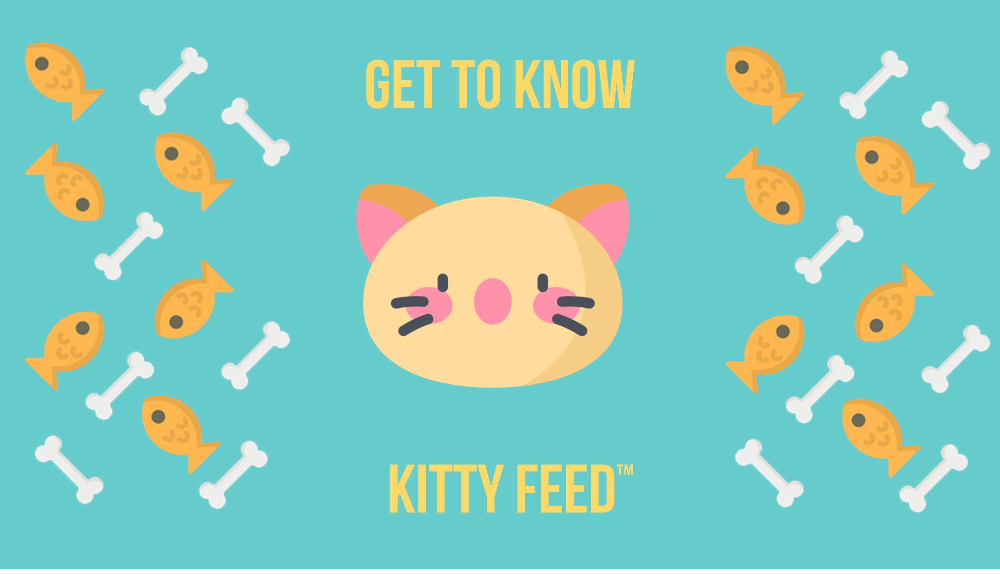

# KittyFeed

Feed your cat everywhere, even when you're not around! 🐱

## About

KittyFeed is a remote IoT project made during the Make Or Break 2018 Hackathon.

It consists in an automatic cat feeder that is connected to the internet.

This device alows users to dispense food to their pet anywhere using only an android APP.

## Technology Used

- Android & Java for application control
- Flask for the framework 
- Python for servo control

## Hardware Used
- Raspberry pi 3 Model B
- SM-S4303R continous rotation servo

### Team

- Pedro Ribeiro - Mostly IoT & RaspberryPi configuration and food bowl construction
- João Ribeiro - IoT & RaspberryPi configuration but also Flask & Python for Servo control
- João Freitas - Android application control
- Rita Gonçalves - Android application control

### Icons Used

- [Kitty Icons](https://www.flaticon.com/packs/kitty-avatars-2)
- [Lovely Dog Icon](https://www.flaticon.com/free-icon/dog_720954)
- [Feed Me Now! Icon](https://www.flaticon.com/free-icon/canned-food_829224#term=cat%20food&page=1&position=1)
- [Like Icon](https://www.flaticon.com/free-icon/like_273531#term=thumbs%20up&page=1&position=33)
- [Clock Icon](https://www.flaticon.com/free-icon/gauge_305101)
- [Fish & Bone Background Icons](https://www.flaticon.com/free-icon/food_784103#term=fish%20bone&page=1&position=14)

### Licenses

- The project is licensed under **MIT**
- The icons used can found at [**Flaticon**](https://www.flaticon.com)
- All of them are licensed under the [**Flaticon Basic License**](https://file000.flaticon.com/downloads/license/license.pdf)

### Promo Video

